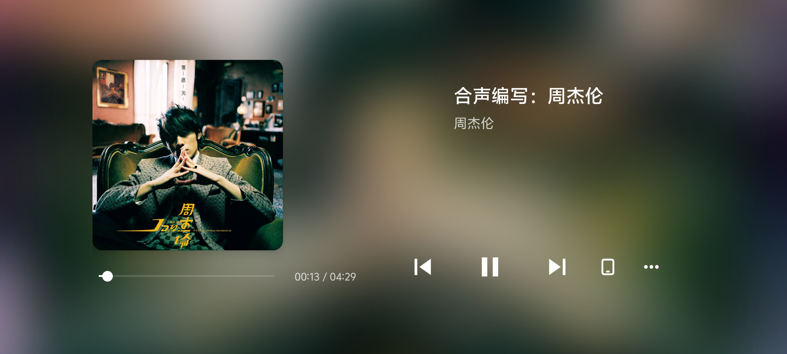
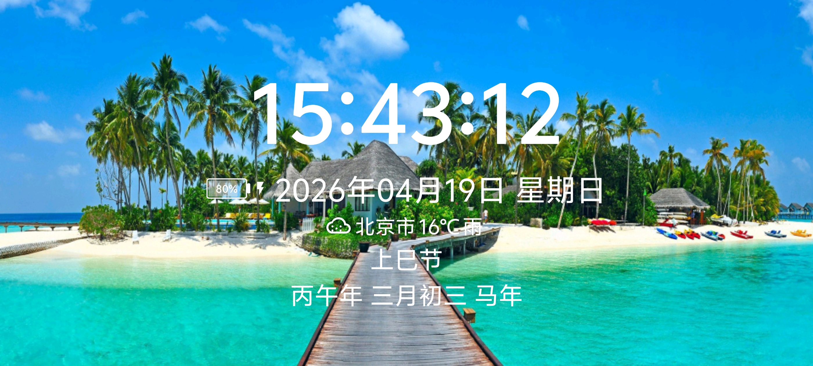

# 🎵🕐 音乐时钟 (Music Clock)

一款集时钟显示与音乐播放于一体的 Android 应用，专为全屏沉浸式体验而设计。支持本地音乐播放与第三方音乐应用控制，搭配动态壁纸、氛围灯效、天气信息与农历显示，打造您的专属桌面时钟。

## 📸 应用截图

<div align="center">
  
  
</div>

**左：时钟主界面** | **右：音乐播放界面**

---

## ✨ 功能介绍

### 🕐 时钟功能

- **全屏时钟显示**：沉浸式全屏设计，时间、日期一目了然，适合作为桌面时钟或屏保使用
- **农历与节日显示**：支持1900-2100年农历转换，显示天干地支、生肖属相、二十四节气
- **传统节日提醒**：自动标注春节、元宵节、端午节、中秋节、除夕等传统节日，以及元旦、劳动节、国庆节等公历节日
- **实时天气信息**：接入腾讯天气API，自动获取当前地区天气状况，包含晴天、多云、阴天、雾、雨、雪、雷暴等多种天气图标显示
- **地区选择**：支持全国31个省、市、自治区的省-市-区三级联动选择，精确定位获取天气数据
- **动态壁纸轮播**：每5分钟自动更换一张高清风景/动漫壁纸，点击背景也可手动切换
- **氛围灯效**：46种色彩氛围灯，随音乐节奏自动变幻颜色，也可点击时钟手动切换
- **时钟样式切换**：双击屏幕切换不同的时钟显示样式
- **电池状态显示**：实时显示电池电量与充电状态
- **网络类型检测**：自动检测当前网络类型，使用移动数据时给出提醒
- **时钟位置随机化**：每分钟时钟位置随机微调，防止屏幕烧屏

### 🎵 音乐功能

- **本地音乐播放**：支持 MP3、FLAC、WAV、OGG、M4A、AAC 等多种音频格式播放
- **第三方音乐控制**：通过 MediaSession 接口，可控制酷狗、网易云音乐、QQ音乐等第三方音乐应用
- **歌词显示**：支持 LRC 歌词解析与实时滚动显示，支持嵌入歌词（MP3 ID3v2 USLT、FLAC Vorbis Comments）和外挂 .lrc 文件
- **专辑封面显示**：自动提取音频文件内嵌封面，支持目录下 cover.jpg、folder.jpg 等封面文件，缺失时自动从 iTunes API 获取
- **高斯模糊背景**：专辑封面自动生成高质量高斯模糊背景，视觉体验更佳
- **横竖屏双模式**：音乐播放器支持横屏和竖屏两种布局，自动适配不同使用场景
- **播放列表管理**：本地音乐文件自动扫描与播放列表管理
- **后台播放**：通过前台服务与保活机制，确保音乐在后台持续播放
- **通知栏控制**：MediaStyle 通知栏，支持上一曲/播放暂停/下一曲操作，显示专辑封面与进度
- **屏幕常亮**：播放期间自动保持屏幕常亮，方便随时查看歌词与封面

### 📺 电视/机顶盒支持

- **D-Pad 键盘导航**：完整的遥控器方向键支持，↑↓切换颜色，←→切换样式
- **焦点导航系统**：所有界面均支持 TV 模式焦点导航，适配 Android TV 与电视盒子
- **操作引导**：首次启动显示操作指南，支持触屏与遥控器两种操作说明

### 🔧 系统功能

- **一像素保活**：通过1×1像素悬浮窗保活机制，防止应用被系统杀死
- **音乐状态检测**：每500ms轮询音乐播放状态，精准检测音乐启停
- **SSL 兼容**：为旧版 Android 设备提供 SSL 信任方案，确保天气与壁纸接口正常访问
- **数据持久化**：使用 SharedPreferences 保存颜色偏好、样式偏好、地区设置等用户配置
- **权限管理**：通知权限、悬浮窗权限等运行时权限申请与引导

---

## 🏗️ 项目结构

```
app/src/main/java/com/xiaowei/music/
├── MainActivity.java              # 时钟主界面
├── MusicPlayerActivity.java       # 音乐播放界面
├── AboutActivity.java             # 关于页面
├── InstructionActivity.java       # 操作说明页面
├── OperationGuideActivity.java    # 首次启动引导页
├── LocationSettingActivity.java   # 地区设置页面
├── LocalMusicHelper.java          # 本地音乐播放管理器
├── MusicDetectorService.java      # 音乐状态检测服务
├── MusicNotificationService.java  # 音乐通知与媒体控制服务
├── KeepAliveService.java          # 一像素保活服务
├── AdvancedBlurUtils.java         # 高斯模糊工具类
└── LunarUtil.java                 # 农历工具类
```

## 🛠️ 技术栈

- **开发语言**：Java
- **最低SDK**：Android 5.0 (API 21)
- **构建工具**：Gradle 8.11.1
- **媒体框架**：MediaPlayer + MediaSession
- **网络请求**：HttpURLConnection
- **数据存储**：SharedPreferences

## 📋 构建与运行

1. 克隆本仓库
```bash
git clone https://github.com/xiaoweimusic/music-clock.git
```

2. 使用 Android Studio 打开项目

3. 同步 Gradle 并编译运行

## 📜 开源协议

本项目基于 [GNU General Public License v3.0](LICENSE) 开源协议发布。

**这意味着您可以：**
- ✅ 自由使用、复制、修改和分发本软件
- ✅ 将本软件用于商业目的
- ✅ 修改后分发您的版本

**但您必须：**
- ⚠️ 分发时必须附带本许可证
- ⚠️ 修改后的作品必须以相同的 GPL-3.0 协议开源
- ⚠️ 保留原始版权声明
- ⚠️ 声明对原始代码所做的修改

选择 GPL-3.0 协议的原因：本项目的修改版本必须同样开源，确保所有用户都能受益于社区的改进和贡献，防止闭源商业化分支的出现。

## 👨‍💻 作者

**小威** - 开发者

---

*如果这个项目对您有帮助，欢迎 Star ⭐ 支持！*
